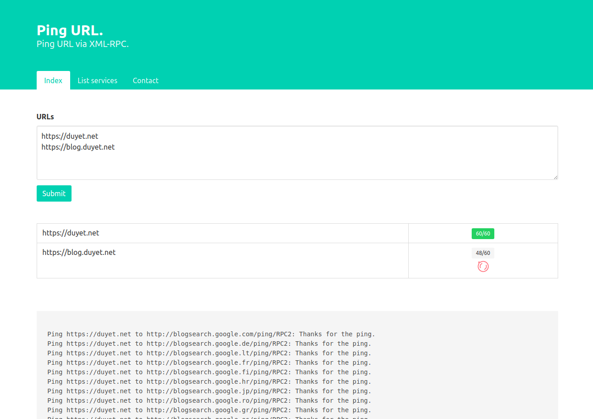

# Ping to Search Engine

# Installation

Requirements:
* PHP >=5.6
* Active functions: `fsockopen` (http://php.net/manual/en/function.fsockopen.php), `curl` (http://php.net/manual/en/book.curl.php)

Install:
* Upload all file to VPS or Host
* Fight!

# Contact

me [at] duyet.net